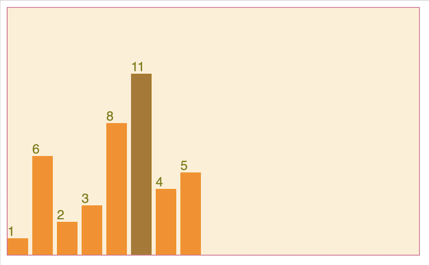
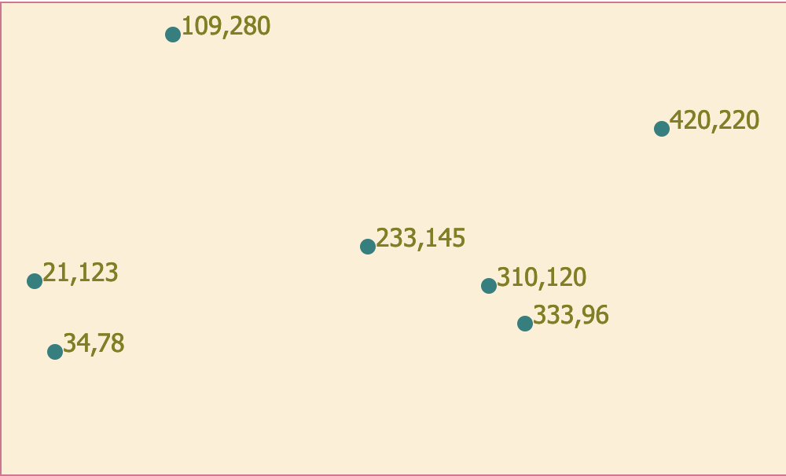

## Learning D3 

Starting with FreeCodeCamp tutorials 

To run this the repo locally:
1. `git clone https://github.com/isnotafunction/FreeCodeCamp-D3.git`

2. open `index.html` in the browser

What I've learnt so far:

*Bar chart*

- [x] Dynamically create new items by looping over a dataset
- [x] Style the items with inline styles or css classes and dynamically update styles based on data from the dataset
- [x] Dynamically create an svg bar chart and position the elements correctly within an svg area.
- [x] Create & style labels
- [x] Add a hover effect
- [x] Add a tooltip

*Scatterplot*   
- [x] create a scatterplot with SVG circles
- [x] add labels to the circles
- [x] add attributes to position and style the circles and labels

